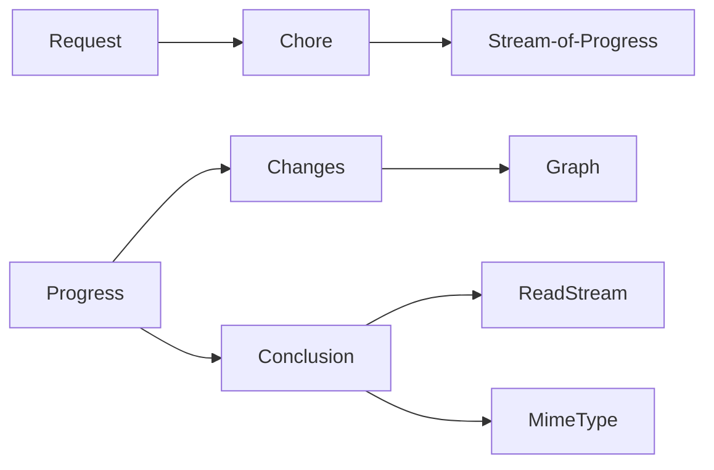

# ChoreDB

A computation + result database, kind of like a reactive file system
with jobs.

###### API

(graphs using [mermaid](https://knsv.github.io/mermaid/#graph))



###### Request a chore to be completed

Import the DB lib, create a request.

`API`
```js
var Ch = require('chore')
Ch.tasks() //=> List Task
```

`Request`
```js
{ task: 'someTask'
/** each task has it's own parameters **/
, someTaskSpecificParameter: ['could', 'be', 'anything']
, anotherParameter: new Date('2016-01-02'),
, someNumericParam: 1234
}
```


```js
var Ch = require('chore')
var chore = Chore({task: 'someTask'}, {/*options*/}) // => Chore
```

`Chore`
```js
chore.progress() // RxJS observable of Progress objects
chore.result()   // promise with Conclusion object
```

`Progress`
```js
.graph()   // => The current state as a graph
.changes() // => List of changes
.numeric() // => Ratio, approaching 1.
```

`Changes`
```js
.history()      // `mori.js` immutable list
.asGraph()      // current change list as graph
.doneRatio()    // 0 <= (n / N) <= 1 rational
```

`Conclusion`
```js
.mimeType()
.raw()     // ReadableStream
.result()  // object
.error()   // optional error
.graph()   // => The current state as a graph
.changes() // => List of changes
.runtime() // => List of changes
```


###### Concept

You load the library.

```js
var Ch = require('chore')
```

Then you can

- request a *chore* (computation job) to run,
- monitor the progress,
- retrieve the result

**Step 1.**

Define our request, the `chore` parameter is is required,
it is the name of the *computation job*.

> `{"chore": "CHORE_NAME"}` is the minimal task description.

Each chore can have parameters, look at the respective docs.

This one has two number parameters `x` and `y`

```json
var c = { "chore": "addNumbers", "x": 1, "y": 2 }
```

**Step 2.** 

Request the chore to be done.

```js
var chore = Ch.do({chore: 'addNumbers', x:1, y:2})
chore.progress() // RxJS observable
chore.result() // promise
})
```

A task thus is a parametrized computation, which may depent on other computations with specific parameters.

These computations form a network, or so called *graph*.
When a computaiton 

which is stored by the system.

Each node is 

```js

```

```js
```


```js
Put.load(task, function(err, result) {
})
```

You describe computation task, by defining nodes
that take as inputs other notestasks. 

###### Simple API

We do our best to keep things simple, so this is how you retrieve something from the db

```js
var Put = require('putdb')

Put.makeMe({
    task: 'my.corp.SometNamedTask',
    param1: [2, 3],
    param2: [{lat: 12.3, lng: 2.34}]
    param3: 'AMS',
    param4: {
    	foo: 'bar',
        tres: 'bien'
    }
})
```


## backends

There are two backends. One for storage and one for computation.

### storage

- write file to storage

### computation

- request a computation
- notify about a result


progress: 34.2,
filename:  null,
done: false